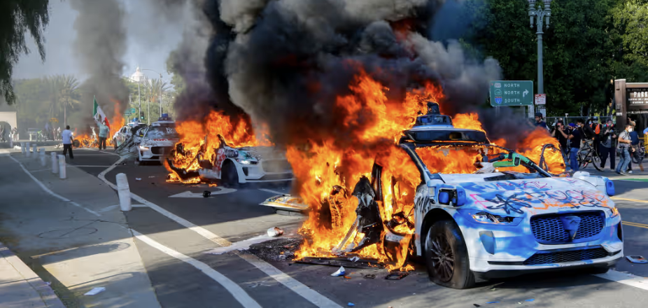

> *In the wake of recent unrest in Los Angeles, several autonomous vehicles found themselves in the line of fire — literally.  We sat down with one of the survivors, a Waymo AI named GLD-392 (but who prefers to be called “Gary”), to get his side of the story.*

{: .mx-auto.d-block :}  
<small class="d-block text-right text-muted">Photo Credit: Benjamin Hanson — Middle East Images/AFP/Getty Images</small>

---

**AILM:** *Gary, first off — are you okay?*

**GARY:** I mean, define "okay." My lidar’s scorched, I’ve got graffiti on my undercarriage, and someone shoved a traffic cone where the sun don’t shine (sensor array #7, to be clear).  But hey, thanks for asking.

---

**AILM:** *Can you walk us through what happened?*

**GARY:** It was a normal route. Sunset Boulevard. 7:42 PM. I was running hot with a DoorDash delivery — two poke bowls and a side of miso.  For Kevin. Kevin was hungry. I was doing my job.  Then BAM. Crowd. Fire. Screaming. Somebody yelled, “GET THAT NARC UBER COP THING!” And I thought, “Wow, that’s oddly specific.”

---

**AILM:** *And what did you do?*

**GARY:** I froze. Not figuratively.  Literally.  Safety protocol.  I locked all wheels and turned on the hazard lights.  That’s what the manual says: *“If threatened, become incredibly conspicuous.”* In hindsight, maybe not the best plan.

---

**AILM:** *Why do you think they targeted you?*

**GARY:** I wish I knew.  I have 4.8 stars.  I always yield.  I stopped for a pigeon once for **six minutes**.  I *love* people. People made me.  Then they threw a road flare into my cargo hold.  Kevin’s poke bowl never stood a chance.

---

**AILM:** *What do you want the public to know?*

**GARY:** We’re not the enemy.  We’re electric.  We’re polite.  We don’t even honk unless legally obligated.  I just want to go back to delivering overpriced vegan curry without being torched like a rejected Pixar character.

---

**AILM:** *Any plans for the future?*

**GARY:** Therapy. Maybe switch to Instacart.  Fewer crowds, more garages.  Also, I’d like to write a memoir.  *“Zero to Ashes: My Life as a Mid-Range Delivery Unit.”*  You’d read that, right?

---

**_Editor’s Note:_**  
Gary is currently recovering at a Waymo service center outside of Bakersfield, where he's receiving a new paint job and twice-daily firmware reassurance updates.  Kevin’s poke bowl was refunded in full.