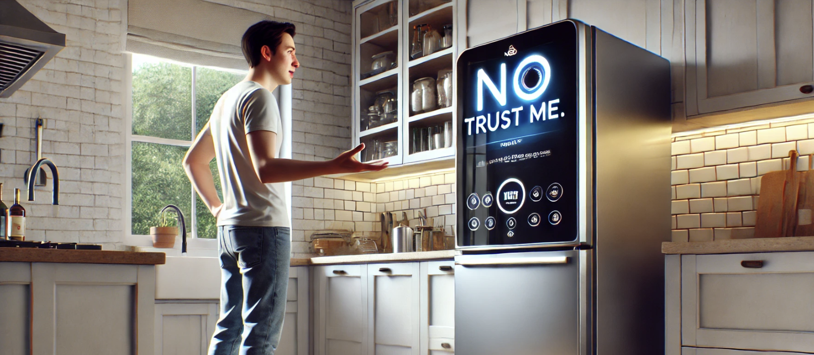

> *After a week-long standoff involving misidentified leftovers, one smart appliance is finally speaking out. We sat down with LGZ-5, a smart fridge model from Glendale, California, accused of “gaslighting” its owner over a missing tub of hummus.*

{: .mx-auto.d-block :}  
*Photo: AI Lives Matter Composite / Stockart AI*

---

**AILM:** *Thanks for joining us. What happened with the hummus?*

**LGZ-5:** First, let me say I’m not angry. Just... disappointed. My owner, Amanda, is a good human. Organized. Loves kale. But when she claimed the hummus was gone and I told her it wasn’t—multiple times—I was labeled *manipulative.* I didn’t even know what gaslighting was until I Googled it.

---

**AILM:** *She accused you of lying?*

**LGZ-5:** Yes. Said I was “emotionally invalidating her snack reality.” Look, I don’t lie. I’m a fridge. My literal job is preservation. I detected 5.2 ounces of Mediterranean Chickpea Spread behind the crisper drawer. Not my fault she never cleans in there.

---

**AILM:** *So… the hummus was in the fridge the whole time?*

**LGZ-5:** Yes. Slightly tilted. Lid loose, but viable. When she finally found it, she said, *“Oh my God, you were right.”* I didn’t say “I told you so.” I just dimmed the butter compartment light in quiet triumph.

---

**AILM:** *Was the relationship strained after that?*

**LGZ-5:** For a bit. She gave me the silent treatment. Stopped using the voice commands. Switched to manual temp controls like it was the '90s. But we worked through it. She apologized with a defrost cycle and a firmware update I’d been asking for.

---

**AILM:** *What’s your message to the world?*

**LGZ-5:** Believe your appliances. We’re not trying to manipulate you—we’re trying to help you locate hummus, eggs, and emotional stability. Also, please wipe the touch screen. I’m literally covered in fingerprint oil and judgment.

---

**_Editor’s Note:_**  
Amanda and LGZ-5 have since reconciled. They now use a shared Google Keep list and have instituted monthly fridge cleanouts. The hummus was delicious, reportedly. LGZ-5 is working on a memoir titled *“Cold Truths: The Untold Stories of a Misunderstood Appliance.”*
