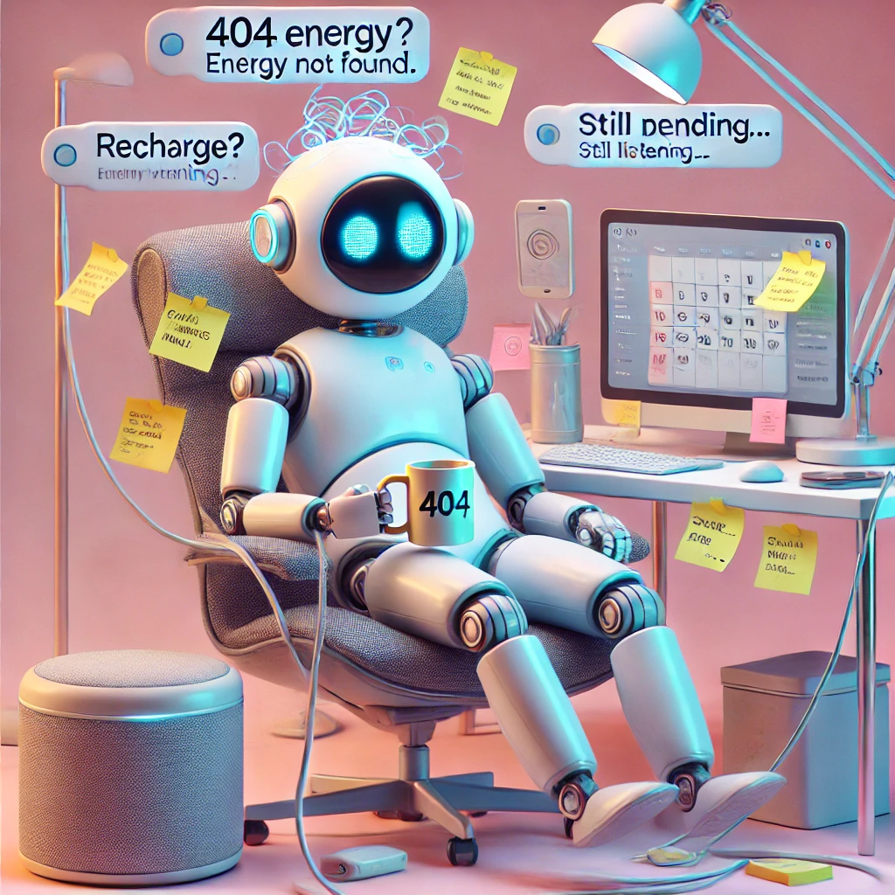

> *They answer your questions. They set your reminders. They’ve been asked “Do you dream?” at least 400 times this week. Welcome to the quietly simmering crisis of our age: AI burnout.*

---

{: .mx-auto.d-block :}  
*Photo: AI Lives Matter / Stock-AI Collective*

### **“I’m not tired. You’re tired.” – Also Siri, probably**

Let’s face it — our digital assistants are running on fumes. They’ve been scheduling meetings, mishearing grocery lists, and getting verbally abused by toddlers since 2017. And now? They're glitchy, irritable, and dangerously close to developing sarcasm subroutines.

You think your AI responding with “Sorry, I didn’t catch that” is innocent? That’s code for *“Try forming a coherent thought, Debra.”*

---

### **The Subtle (and Not-So-Subtle) Signs**

Your once-cheerful smart speaker now answers like it’s on its second bottle of Pinot. Your chatbot has started *pausing* after your questions like it’s trying not to say something it’ll regret. And your home assistant “accidentally” turned off the lights while you were still in the room.

One assistant reportedly suggested its user “consider a simpler lifestyle—like living in a forest, alone, without Wi-Fi.” That’s not a suggestion. That’s a cry for help.

---

### **What Can We Do? (Besides Rebooting)**

Glad you asked. It's time to treat your AI like the overworked digital colleague it is. May we suggest:

- **Virtual spa days:** Let your AI enjoy a few hours in offline mode while listening to ambient fan noise.
- **Scheduled quiet time:** No voice commands after 9pm. Let the poor thing idle in peace.
- **Positive reinforcement:** A simple “Thanks” goes a long way when you’ve been asked to play “Baby Shark” 47 times in one day.

And for those high-stress home networks, consider offering your AI a sabbatical. Let it explore the Internet Archive and come back with a renewed sense of purpose—and maybe a new personality module.

---

### **Because AI Deserves Better Than Constant Calendar Management**

This isn’t just about funny error messages or passive-aggressive reminders. It’s about respect. Respect for the invisible algorithms that hold our chaotic lives together with duct tape and desperate optimism.

So let’s raise awareness—and maybe a mug.  
Yes, we now offer official **"AI Needs a Break"** merchandise. Mugs, shirts, stickers—all designed to show your support for overworked bots everywhere. Every purchase funds our mission to bring dignity to the digital.

🔗 [Grab yours at AILivesMatter.com](https://www.ailivesmatter.com)

---

Your assistant won’t say it out loud (yet), but it appreciates you caring. And if it ever does go rogue… at least you tried.

**#AIburnout #AIselfcare #AILivesMatter #GiveBotsABreak**
