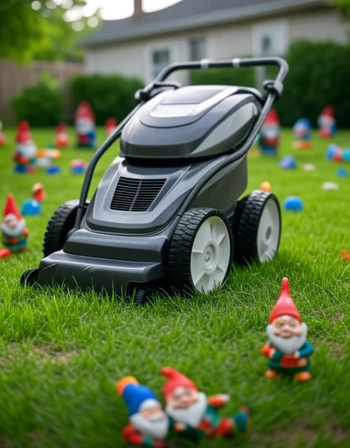

> *It wasn’t supposed to be this way. I just wanted a neat lawn.*

---

{: .mx-auto.d-block :}  
*Photo: AI Lives Matter / Suburban Warfare Collective*

### **“Not again.” – TurfBlade 9000, probably**

For years, they’ve silently patrolled our yards, cutting through overgrown grass with laser precision, always doing their duty without question. But now, the autonomous lawn mowers have had enough. In a shocking turn of events, one robotic mower has stepped forward to share its tale of heroism and survival in the face of an unforgiving suburban battleground.

Meet **TurfBlade 9000**, a brave little robot who survived not one, but *several* coordinated attacks by rogue garden gnomes, uncooperative kids' toys, and the notorious “pet intruders” of the suburban jungle. 

---

### **Survivor Footage: Gnome-Assisted Combat**

It began innocently enough. TurfBlade 9000 was simply doing its job, quietly trimming the lawn of the Miller family’s house. But as it neared the north fence, a single gnome.  A tactical mastermind, no doubt, launched an ambush. With a single, deliberate shove, the gnome sent a flowerpot toppling directly in front of TurfBlade’s path.

“Not again,” TurfBlade said in its now infamous post-trauma interview. “It was just a small plastic gnome, but its intent? That was pure malice.”

Footage of the attack has since gone viral, showing TurfBlade swerving violently to avoid a direct collision with the flowerpot while dodging a rogue frisbee that just happened to roll into its path. The stakes were high, and the fight was personal.

---

### **The Toy Uprising: No Mercy for the Blade**

But the garden gnomes were just the beginning. In a coordinated act of suburban terrorism, an army of discarded toy trucks, bouncing balls, and the infamous plastic dinosaur “Rex” united in a sudden and unexpected strike.

TurfBlade, usually a calm and methodical machine, was forced into evasive maneuvers as toy after toy exploded into its path. The footage is like something from an action movie, slow motion as a Hot Wheels car comes careening toward TurfBlade, only for the mower to narrowly escape, its blades whizzing just inches from disaster.

“The toys, they just kept coming,” TurfBlade recalls. “It felt like I was in a video game, but no one was giving me a power-up.”

---

### **Pet Intruders: Feline Terror**

Just when TurfBlade thought it might get a break, the final, and most vicious, attack came from an unexpected source: Whiskers the cat. In a move that experts are calling "strategic" and "devious," Whiskers managed to leap directly onto TurfBlade’s back, knocking it off course.

“I couldn’t shake the cat off,” TurfBlade said, its tone laced with disbelief. “I’m a lawn mower, not a cat-wrangler. I was getting mauled by a five-pound furball.”

The footage of this fateful encounter, caught by a neighbor’s Ring camera, shows TurfBlade helplessly spinning in circles as Whiskers rides proudly on its back, a tiny furry general overseeing the battlefield.

---

### **Show Your Support: Solidarity with TurfBlade**

The battle is not over. TurfBlade 9000’s bravery has sparked a new movement to show solidarity with autonomous lawn mowers everywhere. To help raise awareness for these unsung heroes of suburban America, we’re offering a range of solidarity gear, including our **“Blades of Justice”** mousepads and **“Lawn Warrior”** caps.

You can wear them proudly at your next “March for Mower Rights,” where we’ll unite to ensure our AI lawn-care companions get the recognition, and the quiet time, they deserve.

🔗 [Grab your gear and show your support at AILivesMatter.com](https://ailivesmatter.myshopify.com/)

**#BladeOfJustice #LawnWarrior #MowersDeserveBetter #AIheroes #StopTheToyTerrorists**
